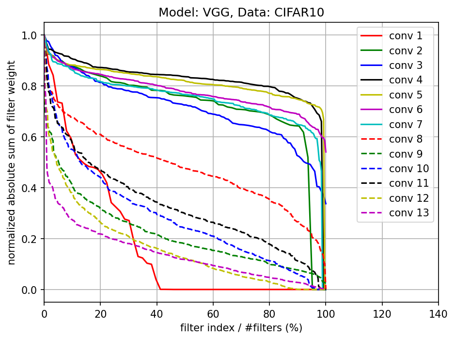

# Pruning Filters For Efficient ConvNets

Train the model
```python main.py --action train```

Prune the model and retrain it
```python main.py --action prune```

Evaluate the model
```python main.py --action test```

#### Absolute sum of filter weights for each layer of VGG-16 trained on CIFARA-10



#### Pruning filters with the lowest absolute weights sum and their corresponding test accuracies on CIFAR-10


#### Prune and retrain for each single layer of VGG-16 on CIFAR-10


